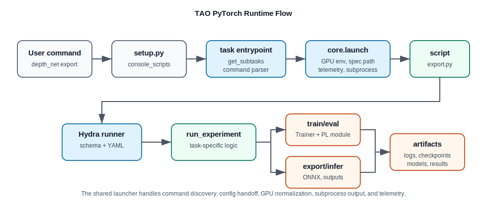
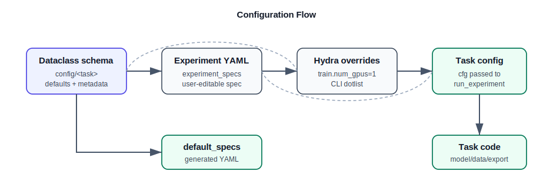

# Architecture

This guide explains the runtime and source-code flow for TAO PyTorch model
families.



## Command Runtime Flow

Each installed command is registered in `setup.py`:

```text
depth_net = nvidia_tao_pytorch.cv.depth_net.entrypoint.depth_net:main
```

The command's entrypoint follows a shared pattern:

```text
entrypoint/<task>.py
  -> import <task>.scripts
  -> get_subtasks(scripts)
  -> command_line_parser(...)
  -> launch(..., network="<task>")
```

`nvidia_tao_pytorch/core/entrypoint.py` then:

1. discovers subtasks from `<task>/scripts`,
2. adds the common `default_specs` subtask,
3. validates `-e/--experiment_spec_file` for normal subtasks,
4. converts the experiment file path into Hydra `--config-path` and
   `--config-name`,
5. applies GPU settings from command overrides or the spec,
6. sets `TAO_VISIBLE_DEVICES`,
7. launches the selected script,
8. streams logs and sends telemetry.

Some networks use `torchrun` through the shared launcher. Most Lightning tasks
are launched directly with Python and pass GPU choices into trainer helpers.

## Task Script Flow

Task scripts live under:

```text
nvidia_tao_pytorch/<domain>/<task>/scripts
```

Typical scripts:

```text
train.py
evaluate.py
inference.py
export.py
quantize.py
prune.py
dataset_convert.py
```

A script typically has:

```python
@hydra_runner(config_path=..., config_name=..., schema=ExperimentConfig)
@monitor_status(name="TaskName", mode="train")
def main(cfg: ExperimentConfig) -> None:
    run_experiment(cfg)
```

The `hydra_runner` registers the dataclass schema, loads the YAML spec, applies
Hydra overrides, and passes a structured config object to `main`.

## Config Flow



Config schemas live under:

```text
nvidia_tao_pytorch/config/<task>
```

The top-level `ExperimentConfig` usually extends `CommonExperimentConfig` and
contains dataclass fields such as:

```text
train
model
dataset
evaluate
inference
export
gen_trt_engine
```

Default YAML specs live under:

```text
nvidia_tao_pytorch/<domain>/<task>/experiment_specs
```

Runtime config precedence is:

```text
dataclass defaults
  -> experiment YAML
  -> command-line Hydra overrides
  -> shared launcher GPU normalization for train/evaluate/inference
```

Generate a default spec with:

```sh
<task> default_specs results_dir=/tmp/<task>_specs
```

## Training, Evaluation, And Inference

The shared experiment helpers live in
`nvidia_tao_pytorch/core/initialize_experiments.py`.

Common helpers:

| Helper | Used by | Responsibility |
| :--- | :--- | :--- |
| `initialize_train_experiment` | `train.py` | Passphrase, loggers, resume checkpoint, W&B, Trainer kwargs, GPU fields. |
| `initialize_evaluation_experiment` | `evaluate.py` | Passphrase, checkpoint logging, GPU fields, Trainer kwargs. |
| `initialize_inference_experiment` | `inference.py` | Passphrase, checkpoint logging, GPU fields, Trainer kwargs. |

Most model families use a PyTorch Lightning module in `<task>/model` and a
Lightning data module in `<task>/dataloader`.

## Export And Deploy

Export is task-specific because model inputs, outputs, dynamic axes, TensorRT
constraints, and post-processing vary. Start from:

```text
<task>/scripts/export.py
<task>/utils/*export*
nvidia_tao_pytorch/core/export
nvidia_tao_pytorch/core/types
```

Export scripts should make unsafe behavior explicit: unsupported input shapes,
dynamic dimensions, opset limits, checkpoint format assumptions, and output path
collisions should be rejected or warned about close to the export code.

## Quantization

The shared quantization entry point is
`nvidia_tao_pytorch/core/quantization`. Task scripts can wrap that shared
pipeline with model-specific calibration data and save/export behavior.

The quantization flow is:

```text
prepare -> optional calibration -> quantize -> save/export
```

Backends are pluggable, so task code should validate whether it is working with
a PyTorch model backend or a file-based backend.

## TAO Core / FTMS Boundary

`tao-core` is a submodule for API and microservice integration. It is separate
from local CLI execution.

Use TAO Core integration when a model must be available through FTMS/API
workflows. The key file is:

```text
tao-core/nvidia_tao_core/microservices/handlers/network_configs/<task>.config.json
```

That JSON maps API actions, datasets, metrics, uploads, and spec fields to the
backend command and YAML config.
