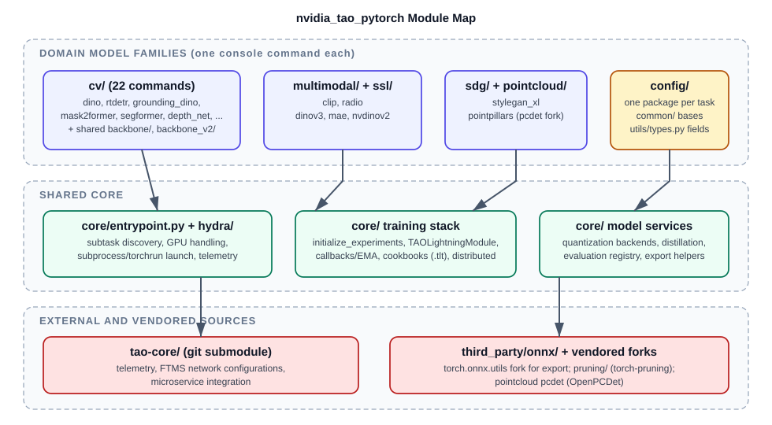

# Codebase Tour

This is a guided walk through the TAO PyTorch repository for developers picking
up the codebase for the first time. It answers three questions: what each
directory is for, how the Python package is organized into modules, and where
the sharp edges are. For the runtime and data-flow view, read
[Architecture](architecture.md) next.



## Repository Layout

```text
tao-pytorch/
├── nvidia_tao_pytorch/       # The installable Python package (everything shipped in the wheel)
│   ├── cv/                   # 27 computer vision families + shared backbone/, backbone_v2/
│   ├── multimodal/           # clip, radio
│   ├── ssl/                  # dinov3, mae, nvdinov2 (self-supervised learning)
│   ├── sdg/                  # stylegan_xl (synthetic data generation)
│   ├── pointcloud/           # pointpillars (with a vendored OpenPCDet fork)
│   ├── core/                 # Shared launcher, Hydra, Lightning, checkpoint, quantization, distillation
│   ├── config/               # Hydra dataclass schemas, one package per task
│   └── pruning/              # Vendored torch-pruning (not a model family)
├── third_party/onnx/         # Vendored fork of torch.onnx.utils used by export paths
├── runner/tao_pt.py          # Host-side Docker launcher (not shipped in the wheel)
├── scripts/envsetup.sh       # Defines the tao_pt shell function; installs git hooks
├── docker/                   # Base development image: Dockerfile, manifest.json, requirements
├── release/                  # Release image, wheel build, version metadata (release/python/version.py)
├── tools/                    # README command-table generator, dataclass-to-RST doc tooling
├── tests/                    # pytest suites grouped by domain (225 test files)
├── docs/                     # This documentation
├── .github/                  # GitHub Actions workflows and shared hook scripts
├── tao-core/                 # Git submodule: shared TAO config/microservice/telemetry code
├── setup.py                  # Package definition, console_scripts, and 12 CUDA extensions
└── pytest.ini                # Registered markers and default pytest options
```

The rules of thumb are:

* If it ships to users, it lives under `nvidia_tao_pytorch/` or `third_party/`.
* If it launches or builds containers, it lives in `runner/`, `docker/`, or
  `release/`.
* If it validates the repository, it lives in `tests/`,
  `.pre-commit-config.yaml`, or `.github/workflows/`.

## The Package in One Table

| Module | Role | Key files |
| :--- | :--- | :--- |
| `<domain>/<family>/` | One model family: entrypoint shim, subtask scripts, Lightning module, dataloader, and default specifications. | `entrypoint/<family>.py`, `scripts/*.py`, `model/pl_*_model.py`, `dataloader/`, `experiment_specs/*.yaml` |
| `core/entrypoint.py` | The shared launcher: subtask discovery, GPU normalization, `torchrun` selection, subprocess launch, and telemetry. | `get_subtasks`, `launch`, `LIGHTNING_EXCLUDED_NETWORKS` |
| `core/hydra/hydra_runner.py` | Schema registration and Hydra invocation. | `hydra_runner` decorator |
| `core/decorators/` | `@monitor_status` (results directory, `status.json`, error classification) and `@experimental`. | `workflow.py`, `experimental.py` |
| `core/initialize_experiments.py` | Shared train/evaluate/inference setup: passphrase, loggers, seed, determinism, resume checkpoint, and Trainer kwargs. | `initialize_train_experiment`, ... |
| `core/lightning/`, `core/callbacks/` | `TAOLightningModule`, status-logger callback, EMA, exception checkpointing. | `tao_lightning_module.py`, `ema.py` |
| `core/cookbooks/`, `core/checkpoint_encryption.py` | Encrypted `.tlt` checkpoint handling over EFF archives. | `TLTPyTorchCookbook` |
| `core/quantization/` | Pluggable quantization: `ModelQuantizer` front door over registered backends (`modelopt.pytorch`, `modelopt.onnx`, `torchao`). | `quantizer.py`, `registry.py`, `backends/` |
| `core/distillation/`, `core/evaluation/`, `core/distributed/` | Distiller helpers, evaluator registry (kNN, retrieval, segmentation), and distributed communication and validation. | `distiller.py`, `base.py`, `comm.py` |
| `config/<task>/` | Structured dataclass schema per task. | `default_config.py` (always defines `ExperimentConfig`) |
| `config/common/` | Shared configuration bases every task extends. | `common_config.py`, `quantization/default_config.py` |
| `config/utils/types.py` | Typed field factories that attach FTMS/AutoML metadata. | `STR_FIELD`, `INT_FIELD`, `DATACLASS_FIELD`, ... |
| `cv/backbone/`, `cv/backbone_v2/` | Shared vision backbones; `backbone_v2/` is the newer registry-driven set (DINOv2/v3, SAM3, SigLIP2, Hiera, RADIO). | `registry.py`, `backbone_base.py` |

## Model Family Inventory

Each console command (registered in `setup.py`, 29 total) maps to one family
package:

| Domain | Families |
| :--- | :--- |
| `cv/` | `action_recognition`, `bevfusion`, `centerpose`, `classification_pyt`, `deformable_detr`, `depth_net`, `dino`, `grounding_dino`, `mal`, `mask2former`, `mask_grounding_dino`, `ml_recog`, `ocdnet`, `ocrnet`, `oneformer`, `optical_inspection`, `pose_classification`, `re_identification`, `rtdetr`, `segformer`, `sparse4d`, `visual_changenet` |
| `multimodal/` | `clip`, `radio` |
| `ssl/` | `dinov3`, `mae`, `nvdinov2` |
| `sdg/` | `stylegan_xl` |
| `pointcloud/` | `pointpillars` |

Four additional packages have an `entrypoint/` but no `console_scripts` entry,
so they are not installable commands: `codetr`, `nvpanoptix3d`, `odise`, and
`segformer_old`. One (`segic`) is a research drop with no entrypoint at all.

Nearly all families follow the modern pattern (`hydra_runner` +
`monitor_status` + `initialize_*_experiment` + Lightning). The main outliers
are `pointpillars` (own OpenPCDet fork, no `monitor_status`, plus a second
non-Hydra `tools/scripts/` tree), `bevfusion` (mmdet3d-style runner), and
`odise`.

## Anatomy of One Family: `dino`

```text
nvidia_tao_pytorch/cv/dino/
├── entrypoint/dino.py            # ~30 lines: argparse shim over core/entrypoint.py
├── scripts/                      # train, evaluate, inference, export, convert, distill, quantize
├── model/                        # DINO model code + pl_dino_model.py (DINOPlModel)
├── model/vision_transformer/     # ViT-adapter backbone modules
├── distillation/                 # Family-specific distiller
├── utils/onnx_export.py          # Export helpers
└── experiment_specs/             # train.yaml, evaluate.yaml, infer.yaml, export.yaml, distill.yaml, ...
nvidia_tao_pytorch/config/dino/
└── default_config.py + dataset.py, model.py, train.py, deploy.py
```

Notice what is *missing*: `dino` has no `dataloader/` of its own. It imports
`ODDataModule` from
`nvidia_tao_pytorch/cv/deformable_detr/dataloader/pl_od_data_module.py`, and
its dataset schema also builds on `config/deformable_detr`. Sharing a sibling
family's modules is a normal pattern; check for an existing implementation
before writing a new one.

Command flow for `dino train -e spec.yaml`:

1. The `dino` console script calls `cv/dino/entrypoint/dino.py:main`, which
   delegates to `core/entrypoint.py`: `get_subtasks()` discovers `scripts/*.py`
   as subtasks and injects the synthetic `default_specs` subtask.
2. `launch()` normalizes GPU settings, sets `TAO_VISIBLE_DEVICES`, and **spawns
   a fresh Python subprocess** for the selected script (`torchrun` instead for
   the families in `LIGHTNING_EXCLUDED_NETWORKS`).
3. Inside the child, `@hydra_runner(..., schema=ExperimentConfig)` validates
   the YAML against the dataclass schema and `@monitor_status(...)` creates the
   results directory and writes `status.json`.
4. `initialize_train_experiment(cfg, key)` sets the encryption passphrase,
   loggers, seed, determinism flags, and resume checkpoint, and returns Trainer
   kwargs.
5. The script builds `ODDataModule(cfg.dataset)` and
   `DINOPlModel(cfg)`, constructs the Lightning `Trainer`, swaps in
   `TLTCheckpointConnector` when resuming from a `.tlt` archive, and calls
   `trainer.fit(...)`.

The subprocess step matters for debugging: breakpoints set in a `scripts/*.py`
are never hit when you launch via the console command. Run the script module
directly with `--config-path`/`--config-name` to debug it in-process.

## Sharp Edges

The following behaviors surprise every new developer; they are collected in
one place:

* **The CLI shells out.** `core/entrypoint.py::launch()` runs each subtask as
  a child process, re-parses its stdout, and classifies failures by
  string-matching exception messages against the phrases `monitor_status`
  writes. Debug in-process by running the script directly.
* **`torchrun` applies to exactly three families.**
  `LIGHTNING_EXCLUDED_NETWORKS = ["bevfusion", "pointpillars", "rtdetr"]` in
  `core/entrypoint.py`. Adding a non-Lightning family means editing that
  shared list. `rtdetr` is torchrun-launched despite using Lightning.
* **GPU configuration is rewritten behind your back.** `launch()` reconciles
  `num_gpus` and `gpu_ids` and exports `TAO_VISIBLE_DEVICES`;
  `initialize_train_experiment` then overwrites the configuration values from
  that variable. In the multinode branch (`WORLD_SIZE` set), the launcher
  writes the reconciled values **back into your specification file on disk**.
* **`${eval:...}` in a specification executes arbitrary Python.**
  `core/hydra/hydra_runner.py` registers an `eval` resolver at import time.
* **`.tlt` checkpoints depend on a process-global passphrase.**
  `TLTPyTorchCookbook.set_passphrase(key)` runs inside
  `initialize_*_experiment`; code that touches encrypted checkpoints before
  that call fails. Resume accepts only `.tlt` or `.pth`, and `.tlt` resume
  requires each family's `train.py` to swap in `TLTCheckpointConnector`.
* **`setup.py` imports torch and builds 12 CUDA extensions.** You cannot even
  parse package metadata without torch installed, and `pip install -e .`
  compiles extensions for deformable attention, BEV pooling, StyleGAN plugins,
  Sparse4D, and RADIO ops. Plan for a 10 to 15 minute build inside the
  container.
* **Python 3.12-only f-strings break CI.** The `static-tests` workflow runs
  pre-commit on Python 3.11, and pylint follows imports, so a nested
  same-quote f-string (PEP 701) anywhere in the import graph fails unrelated
  pull requests with a syntax error. Sweep with `ast.parse` before pushing.
* **`gen_trt_engine` is not in this repository.** `GenTrtEngineConfig` and
  `TrtConfig` exist in `config/common/common_config.py` for tao-deploy and
  FTMS to consume; no script here implements them.
* **`tao-core/` is an empty directory** until
  `git submodule update --init`. Telemetry degrades gracefully without it, but
  FTMS network configurations and the container `PYTHONPATH` assume it is
  populated.
* **`deformable_detr` has a wide blast radius.** More than a dozen packages import
  from it (dino, rtdetr, grounding_dino, mask2former, oneformer, segformer,
  and others), and two distinct classes named `ODDataModule` exist
  (`deformable_detr` and `rtdetr`). Run the dependent families' tests when you
  touch it.
* **Marker hygiene is incomplete.** `pytest.ini` registers 17 markers without
  `--strict-markers`, and roughly 28 markers used in tests (including the
  heavily used `ssl_unit`) are unregistered, so `-m` selection can silently
  select nothing. Prefer path-based selection.
* **Determinism has a hidden cost.** Setting `train.cudnn.deterministic`
  makes `initialize_train_experiment` disable flash and memory-efficient SDP
  attention globally, which slows ViT-class backbones substantially.
* **Naming quirks.** `classification_pyt`'s entrypoint module is
  `classification.py`; `segformer_old` imports `config/segformer` while its
  tests import `config/segformer_mmlab`; the point cloud test directory is
  `tests/pointcloud_unit_tests` (plural) unlike every other `*_unit_test`.
