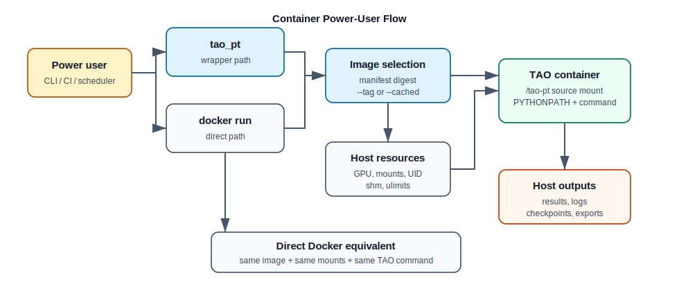

# Container Power Users

This guide is for users who run TAO workflows from prebuilt containers, custom
tags, or direct Docker commands.



## Image Types

TAO PyTorch uses two main image concepts:

| Image | Source of truth | Purpose |
| :--- | :--- | :--- |
| Development base image | `docker/manifest.json` | Base environment used by `tao_pt`; repository source is mounted at `/tao-pt`. |
| Release image | `release/docker/deploy.sh` | Wheel-installed runtime image built from this repository. |
| Local tagged image | `docker/build.sh` or manual tagging | Test a locally built base image with `tao_pt --tag <tag>`. |
| Explicit cached image | Any full Docker image reference | Override launcher image selection with `tao_pt --cached <image>`. |

`docker/manifest.json` stores platform-specific digests. The launcher chooses
the `x86` digest on `x86_64` hosts and the `arm` digest on `aarch64` hosts.

## What `tao_pt` Does

`tao_pt` is defined by `scripts/envsetup.sh` and calls `runner/tao_pt.py`.
It wraps `docker run` and sets up a developer container.

Key behavior:

| Behavior | Details |
| :--- | :--- |
| Repository mount | Mounts `$NV_TAO_PYTORCH_TOP` to `/tao-pt`. |
| Python path | Adds `/tao-pt` to `PYTHONPATH`; `envsetup.sh` also helps local `tao-core` imports. |
| Image selection | Uses `docker/manifest.json` digest unless `--tag` or `--cached` is provided. |
| GPUs | Uses modern `--gpus` when possible; falls back to NVIDIA runtime env vars on older Docker or Tegra systems. |
| Mounts | Reads `~/.tao_mounts.json`, an optional `--mounts_file`, and repeated `--volume` flags. |
| User mapping | `--run_as_user` runs as host UID/GID to avoid root-owned outputs. |
| Runtime options | Supports `--shm_size`, repeated `--ulimit`, `--port`, and `--no-tty`. |
| Network | Uses host networking. |

Basic interactive use:

```sh
source scripts/envsetup.sh
tao_pt --gpus all --run_as_user -- bash
```

Run a command non-interactively:

```sh
tao_pt --gpus all --no-tty -- \
  depth_net train -e /workspace/specs/depth_net.yaml
```

## Mount Data, Specs, And Results

One-off mounts:

```sh
tao_pt --gpus all \
       --run_as_user \
       --volume /data/depth:/data/depth \
       --volume /home/user/specs:/workspace/specs \
       --volume /home/user/results:/results \
       -- bash
```

Reusable mounts in `~/.tao_mounts.json`:

```json
{
  "Mounts": [
    {
      "source": "/data",
      "destination": "/data"
    },
    {
      "source": "/home/user/tao-results",
      "destination": "/results"
    }
  ]
}
```

The launcher validates host mount paths before starting the container.

## Direct Docker Equivalent

Use this when you want full control instead of `tao_pt`.

First derive the dev image reference from `docker/manifest.json`:

```sh
python - <<'PY'
import json
import platform
from pathlib import Path

cfg = json.loads(Path("docker/manifest.json").read_text())
arch = "arm" if platform.machine() == "aarch64" else "x86"
print(f"{cfg['registry']}/{cfg['repository']}@{cfg['digests'][arch]}")
PY
```

Then run Docker directly:

```sh
DEV_IMAGE="nvcr.io/nvstaging/tao/tao_pytorch_base_image@sha256:<digest>"

docker run --rm -it \
  --gpus all \
  --net=host \
  --shm-size 16G \
  --user "$(id -u):$(id -g)" \
  -v "$PWD:/tao-pt" \
  -v /data:/data \
  -v /home/user/results:/results \
  -e PYTHONPATH=/tao-pt:${PYTHONPATH} \
  "$DEV_IMAGE" \
  bash
```

Inside the container:

```sh
cd /tao-pt
depth_net default_specs results_dir=/results/specs/depth_net
```

## Local Source Edits With A Prebuilt Image

This is the normal development workflow:

```sh
source scripts/envsetup.sh
tao_pt --gpus all --run_as_user -- bash
```

Because the repo is mounted to `/tao-pt`, Python imports local source files
instead of a wheel installed in the image. This is useful for testing source
edits against a stable prebuilt base environment.

## Release Image Versus Source-Mounted Dev Image

Use the source-mounted development image when you are editing code:

```sh
tao_pt --gpus all --run_as_user -- bash
```

Use a release image when you want to test the wheel-installed runtime behavior.
The release tag is composed in `release/docker/deploy.sh` from `tao_version`,
`pytorch_version`, and `build_id`.

Example release run pattern:

```sh
docker run --rm -it \
  --gpus all \
  --net=host \
  --shm-size 30g \
  --ulimit memlock=-1 \
  --ulimit stack=67108864 \
  -v /data:/data \
  -v /home/user/results:/results \
  nvcr.io/nvstaging/tao/tao-toolkit-pyt:<release-tag> \
  bash
```

## Local Tags And Cached Images

Use `--tag` for locally built images in the configured registry/repository:

```sh
cd docker
./build.sh --build --x86
cd ..
tao_pt --tag "$USER" -- bash
```

Use `--cached` for a fully specified image reference:

```sh
tao_pt --cached nvcr.io/example/custom-tao-pytorch:debug -- bash
```

`--cached` bypasses the manifest/tag construction and is the most explicit
choice for CI, debugging, or one-off image experiments.

## x86 And ARM Images

The launcher selects the digest based on host architecture:

| Host architecture | Manifest key |
| :--- | :--- |
| `x86_64` | `digests.x86` |
| `aarch64` | `digests.arm` |

Build base images by platform:

```sh
cd docker
./build.sh --build --x86
./build.sh --build --arm
./build.sh --build --multiplatform --push
```

Multi-platform builds require `--push`. Cross-platform builds may set up QEMU
through Docker buildx.

## CI And Scheduler Jobs

Prefer non-interactive mode:

```sh
tao_pt --gpus all \
       --no-tty \
       --run_as_user \
       --volume /data:/data \
       --volume /results:/results \
       -- \
       dino train -e /results/specs/dino.yaml
```

Use explicit images for reproducibility:

```sh
tao_pt --cached nvcr.io/example/tao-pytorch@sha256:<digest> --no-tty -- \
  pytest tests/cv_unit_test/depth_net
```

Capture the printed `docker run` command from `tao_pt` logs when debugging CI
environment differences.

## Troubleshooting

| Symptom | Check |
| :--- | :--- |
| Pull fails | Run `docker login nvcr.io` and confirm access to the configured registry/repository. |
| Unexpected image version | Inspect `docker/manifest.json`, `--tag`, and `--cached`; `--cached` is the most explicit override. |
| GPU unavailable | Check host `nvidia-smi`, container `nvidia-smi`, Docker API version, and `nvidia-container-toolkit`. |
| Output files are root-owned | Add `--run_as_user` or direct Docker `--user "$(id -u):$(id -g)"`. |
| Path exists on host but not in container | Check `--volume` or mounts file source/destination pairs. |
| DataLoader worker or NCCL errors | Increase `--shm_size`; consider memlock/stack ulimits for release-style runs. |
| Port not reachable | The launcher uses host networking; verify the service binds to the expected host/interface. |
| ARM/x86 mismatch | Check `uname -m`, manifest digest selection, and platform-specific build flags. |
| Cross-platform build fails | Ensure Docker buildx works and QEMU/binfmt support is installed. |
