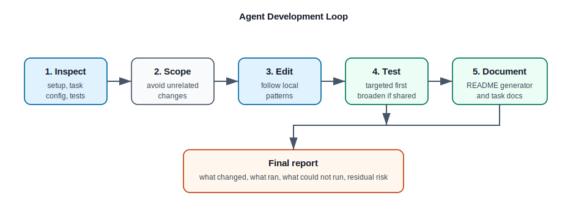

# Development Workflows

This guide gives concrete recipes for common source-code changes.



## Trace A Command To Code

Use this when a user mentions a command such as `depth_net export`.

```sh
rg -n "depth_net=" setup.py
sed -n '1,220p' nvidia_tao_pytorch/cv/depth_net/entrypoint/depth_net.py
sed -n '1,260p' nvidia_tao_pytorch/cv/depth_net/scripts/export.py
```

Then inspect config and tests:

```sh
find nvidia_tao_pytorch/config/depth_net -maxdepth 2 -type f | sort
find nvidia_tao_pytorch/cv/depth_net/experiment_specs -maxdepth 1 -type f | sort
find tests -path '*depth_net*' -type f | sort
```

## Add A Config Field

1. Add the dataclass field under `nvidia_tao_pytorch/config/<task>`.
2. Use helpers from `nvidia_tao_pytorch/config/utils/types.py`.
3. Add the field to the relevant experiment spec YAML if the default should be
   visible to users.
4. Update task code to read the field from `cfg`.
5. Add or update a config test.

Useful commands:

```sh
rg -n "class .*Config|DATACLASS_FIELD|STR_FIELD|INT_FIELD" nvidia_tao_pytorch/config/<task>
rg -n "<field_name>" nvidia_tao_pytorch/<domain>/<task> tests
pytest tests/cv_unit_test/<task>/test_config.py
```

## Modify Export Behavior

1. Start at `<task>/scripts/export.py`.
2. Identify checkpoint loading, model wrapping, dummy inputs, input/output names,
   dynamic axes, opset version, and ONNX validation.
3. Check deploy/export config fields under `nvidia_tao_pytorch/config/<task>`.
4. Add tests around the narrow behavior change.

Useful commands:

```sh
sed -n '1,320p' nvidia_tao_pytorch/<domain>/<task>/scripts/export.py
rg -n "onnx|dynamic|opset|checkpoint|export" nvidia_tao_pytorch/<domain>/<task> nvidia_tao_pytorch/config/<task>
find tests -path '*<task>*' -type f | sort
pytest tests/cv_unit_test/<task>/test_export.py
```

If the model has unsafe dynamic-shape behavior, document and enforce that in
the export path rather than relying on downstream TensorRT failures.

## Debug A Dataloader

1. Find the task data module.
2. Check stage handling: `fit`, `test`, `predict`, or task-specific stages.
3. Inspect dataset config fields.
4. Reproduce with the smallest dataset fixture or mocked input.

Useful commands:

```sh
find nvidia_tao_pytorch/<domain>/<task> -path '*dataloader*' -type f | sort
rg -n "class .*DataModule|setup\\(|train_dataloader|test_dataloader|predict_dataloader" nvidia_tao_pytorch/<domain>/<task>
rg -n "dataset" nvidia_tao_pytorch/config/<task> tests/*/*/<task>
pytest tests/cv_unit_test/<task>/test_dataloader.py
```

## Add A Subtask

1. Add `<task>/scripts/<subtask>.py`.
2. Use `hydra_runner` and `monitor_status` unless the subtask is intentionally
   standalone.
3. Add an experiment spec YAML if the subtask needs one.
4. Add config fields under `nvidia_tao_pytorch/config/<task>` if needed.
5. Add tests and run the README command-table generator.

Commands:

```sh
python tools/update_readme_supported_commands.py
python tools/update_readme_supported_commands.py --check
```

The shared entrypoint discovers scripts automatically after the package command
is registered in `setup.py`.

## Trace Checkpoint Loading

Checkpoint handling often differs across pretrained, TAO encrypted, public, and
research checkpoints.

Useful commands:

```sh
rg -n "checkpoint|pretrained|load_from_checkpoint|torch.load|TLTPyTorchCookbook|\\.tlt|\\.pth" nvidia_tao_pytorch/<domain>/<task> nvidia_tao_pytorch/core
rg -n "resume_training_checkpoint_path|pretrained_model_path|checkpoint" nvidia_tao_pytorch/config/<task>
```

Check both task scripts and Lightning modules. Training resume is often handled
by `initialize_train_experiment`; task-specific pretrained loading is usually in
the train script or model builder.

## Add Tests For A Task Package

Prefer focused tests that match the changed behavior:

```sh
pytest tests/cv_unit_test/<task>/test_config.py
pytest tests/cv_unit_test/<task>/test_model.py
pytest tests/cv_unit_test/<task>/test_dataloader.py
pytest tests/cv_unit_test/<task>/test_export.py
```

For shared infrastructure changes, broaden by affected domains:

```sh
pytest tests/core
pytest -m "cv_unit and not tensorrt"
python tools/update_readme_supported_commands.py --check
```

Document any skipped GPU, TensorRT, dataset, or private-checkpoint coverage in
the final change summary.
