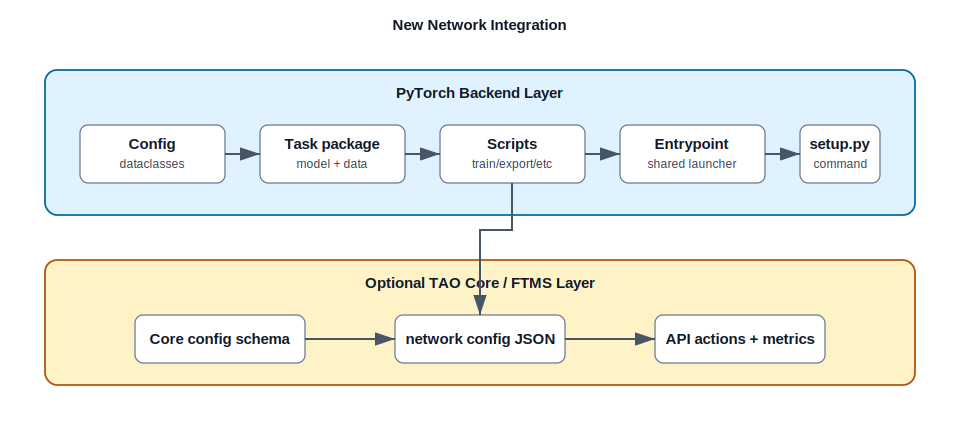

# Integrating a New Network in TAO PyTorch

This guide describes how to add a new model family to the TAO PyTorch backend.
It covers the local PyTorch command first, then the optional TAO Core / FTMS
integration for API and microservice workflows.

The examples use `my_net` as a placeholder. Before copying any structure, inspect
the closest existing model family. TAO PyTorch has several valid implementation
patterns, and the right one depends on domain, dataset shape, export behavior,
and FTMS requirements.

## Two Integration Layers

TAO integration has two related but separate layers:



| Layer | Purpose | Main locations |
| :--- | :--- | :--- |
| PyTorch backend | Makes the model runnable from commands such as `my_net train -e spec.yaml`. | `nvidia_tao_pytorch/<domain>/my_net`, `nvidia_tao_pytorch/config/my_net`, `setup.py` |
| TAO Core / FTMS | Makes the model available through TAO APIs and microservices, including dataset mapping, action mapping, validation, and metrics. | `tao-core/nvidia_tao_core/config/my_net`, `tao-core/nvidia_tao_core/microservices/handlers/network_configs/*.config.json` |

Most model work starts in the PyTorch backend. Add TAO Core integration when the
network needs FTMS/API support.

## Choose A Domain

Place the implementation under the package root that matches the model family:

| Domain | Package root |
| :--- | :--- |
| Computer vision | `nvidia_tao_pytorch/cv` |
| Multimodal | `nvidia_tao_pytorch/multimodal` |
| Self-supervised learning | `nvidia_tao_pytorch/ssl` |
| Synthetic data generation | `nvidia_tao_pytorch/sdg` |
| Point cloud | `nvidia_tao_pytorch/pointcloud` |

## Pick A Reference Model First

Use a real model as the template for the new network. These are useful starting
points because they exercise different integration surfaces:

| Reference | Why it is useful |
| :--- | :--- |
| `dino` | Standard CV detector with train, distill, quantize, evaluate, export, inference, and FTMS mappings for object-detection datasets. |
| `depth_net` | CV model with multiple model/data variants. It uses `model/build_pl_model.py`, mono/stereo Lightning modules, a dataloader factory, task-specific specs, inline export helpers, and separate FTMS configs for mono and stereo. |
| `clip` | Multimodal image-text model. It uses a monolithic config file, a single `experiment_spec.yaml`, tokenizer/preprocess-aware model construction, WebDataset support, PEFT/LoRA config, dual-tower ONNX export behavior, and image-text FTMS mappings. |

Do not assume that a file exists just because it appears in another task. For
example, `depth_net` does not have `model/build_nn_model.py`,
`model/pl_depth_net_model.py`, or `utils/onnx_export.py`; its equivalents live
under `model/build_pl_model.py`, `model/mono_depth/`,
`model/stereo_depth/`, and `scripts/export.py`.

## Common Package Shape

Most model packages have this high-level shape:

```text
nvidia_tao_pytorch/
  <domain>/my_net/
    __init__.py
    entrypoint/
      __init__.py
      my_net.py
    scripts/
      __init__.py
      train.py
      evaluate.py
      inference.py
      export.py
      quantize.py        # optional
      prune.py           # optional
      convert.py         # optional
      dataset_convert.py # optional
    experiment_specs/
      *.yaml
    model/
      __init__.py
    dataloader/
      __init__.py
    utils/
      __init__.py        # optional
```

The subdirectories under `model/` and `dataloader/` vary by model family:

| Pattern | Example |
| :--- | :--- |
| Single Lightning module and datamodule | Many CV task packages use `pl_<net>_model.py` and `pl_<net>_data_module.py`. |
| Variant factory | `depth_net` dispatches mono/stereo datamodules from `dataloader/__init__.py` and model variants from `model/build_pl_model.py`. |
| Multimodal bundle | `clip` builds a wrapper containing model, tokenizer, and preprocessing functions before constructing the datamodule. |

Add configuration dataclasses separately under `nvidia_tao_pytorch/config`.
Some models split the schema across files such as `model.py`, `dataset.py`,
`train.py`, and `deploy.py`; others, such as CLIP, keep the full schema in a
single `default_config.py`. Both conventions are valid.

## How Command Discovery Works

TAO model commands are registered in `setup.py` under
`entry_points["console_scripts"]`. The shared launcher in
`nvidia_tao_pytorch/core/entrypoint.py` then:

1. imports the model package's `scripts` module,
2. discovers each script as a subtask,
3. adds the common `default_specs` subtask,
4. validates `-e/--experiment_spec_file` for normal subtasks,
5. configures visible GPUs,
6. launches the selected script with Hydra overrides.

That means a new local subtask normally needs `scripts/<subtask>.py` plus the
model console command registered in `setup.py`. FTMS may expose additional
action names, such as `gen_trt_engine`, through TAO Core mappings even when the
PyTorch package does not have a same-named script.

## Step 1: Add Config Dataclasses

Define the structured experiment schema under `nvidia_tao_pytorch/config/my_net`.
The top-level config class usually extends `CommonExperimentConfig`; its exact
class name can vary, but task scripts commonly import it as `ExperimentConfig`.

Include sections for every supported action and shared service, not only
`train`, `model`, and `dataset`. Real examples include:

| Section | When to include |
| :--- | :--- |
| `dataset` | Dataset paths, formats, transforms, sampling, WebDataset, or data services mapping. |
| `model` | Architecture, backbone, checkpoint, PEFT, and model-size fields. |
| `train` | Training, resume, distributed, precision, checkpoint, and optimizer fields. |
| `evaluate` | Evaluation checkpoint, metrics, data split, and output fields. |
| `inference` | Inference inputs, checkpoint, visualization, and output fields. |
| `export` | ONNX, precision, dynamic axes, checkpoint, tokenizer, or metadata fields. |
| `gen_trt_engine` | TensorRT engine generation fields when exposed by deploy or FTMS flows. |
| `quantize` | Calibration or ModelOpt fields if quantization is supported. |
| `wandb` | Weights & Biases fields when the task supports W&B logging. |
| `distill`, `prune`, `peft` | Task-specific optional sections. |

Skeleton:

```python
from dataclasses import dataclass

from nvidia_tao_pytorch.config.common.common_config import CommonExperimentConfig
from nvidia_tao_pytorch.config.utils.types import DATACLASS_FIELD
from nvidia_tao_pytorch.config.my_net.dataset import MyNetDatasetConfig
from nvidia_tao_pytorch.config.my_net.deploy import MyNetExportConfig
from nvidia_tao_pytorch.config.my_net.evaluate import MyNetEvalConfig
from nvidia_tao_pytorch.config.my_net.inference import MyNetInferenceConfig
from nvidia_tao_pytorch.config.my_net.model import MyNetModelConfig
from nvidia_tao_pytorch.config.my_net.train import MyNetTrainConfig


@dataclass
class ExperimentConfig(CommonExperimentConfig):
    dataset: MyNetDatasetConfig = DATACLASS_FIELD(
        MyNetDatasetConfig(),
        description="Dataset configuration.",
    )
    model: MyNetModelConfig = DATACLASS_FIELD(
        MyNetModelConfig(),
        description="Model configuration.",
    )
    train: MyNetTrainConfig = DATACLASS_FIELD(
        MyNetTrainConfig(),
        description="Training configuration.",
    )
    evaluate: MyNetEvalConfig = DATACLASS_FIELD(
        MyNetEvalConfig(),
        description="Evaluation configuration.",
    )
    inference: MyNetInferenceConfig = DATACLASS_FIELD(
        MyNetInferenceConfig(),
        description="Inference configuration.",
    )
    export: MyNetExportConfig = DATACLASS_FIELD(
        MyNetExportConfig(),
        description="Export configuration.",
    )

    def __post_init__(self):
        if self.model_name is None:
            self.model_name = "my_net"
```

Use field helpers from `nvidia_tao_pytorch/config/utils/types.py` so metadata is
available to schema validation and default-spec generation:

```python
BOOL_FIELD
DATACLASS_FIELD
FLOAT_FIELD
INT_FIELD
LIST_FIELD
STR_FIELD
```

## Step 2: Add Experiment Specs

Add YAML specs under the model package's `experiment_specs/` directory. Each
task script chooses its default YAML through the `hydra_runner` decorator, so
`config_name` in the script is the source of truth for the file name.

Examples from the repository:

| Model | Script | `config_name` |
| :--- | :--- | :--- |
| `depth_net` | `scripts/train.py` | `train` |
| `depth_net` | `scripts/evaluate.py` | `evaluate` |
| `depth_net` | `scripts/inference.py` | `infer` |
| `depth_net` | `scripts/export.py` | `experiment_spec` |
| `depth_net` | `scripts/quantize.py` | `quantize` |
| `clip` | train/evaluate/export/inference scripts | `experiment_spec` |

Do not assume every task has `train.yaml`, `evaluate.yaml`, `inference.yaml`,
and `export.yaml`. Keep YAML fields aligned with the dataclass schema and the
script's `config_name`. Once the command is registered, validate default-spec
generation with:

```sh
my_net default_specs results_dir=/tmp/my_net_specs
```

## Step 3: Add The Entrypoint

Create the entrypoint under the selected domain package, for example
`nvidia_tao_pytorch/cv/my_net/entrypoint/my_net.py` for a CV network.

Use the standard wrapper:

```python
import argparse

from nvidia_tao_pytorch.cv.my_net import scripts
from nvidia_tao_pytorch.core.entrypoint import (
    command_line_parser,
    get_subtasks,
    launch,
)


def get_subtask_list():
    return get_subtasks(scripts)


def main():
    parser = argparse.ArgumentParser(
        "my_net",
        add_help=True,
        description="Train Adapt Optimize entrypoint for my_net",
    )
    subtasks = get_subtask_list()
    args, unknown_args = command_line_parser(parser, subtasks)
    launch(vars(args), unknown_args, subtasks, network="my_net")


if __name__ == "__main__":
    main()
```

## Step 4: Register The Console Command

Add the command to `setup.py`; change `cv` to the selected domain package when
the model is not a CV network:

```python
"my_net=nvidia_tao_pytorch.cv.my_net.entrypoint.my_net:main",
```

Then update the generated command documentation:

```sh
python tools/update_readme_supported_commands.py
```

Use check mode in CI or pre-merge validation:

```sh
python tools/update_readme_supported_commands.py --check
```

## Step 5: Add Task Scripts

Each local subtask script lives under
`nvidia_tao_pytorch/<domain>/my_net/scripts`. The script should:

1. import the task's experiment config,
2. use `hydra_runner` with the correct `config_name`,
3. use `monitor_status`,
4. call a task-specific `run_experiment` function,
5. preserve encryption-key, checkpoint, distributed, precision, and logging
   behavior required by the task.

Training scripts that use the shared initialization helper should pass the
encryption key. For example, `depth_net` calls
`initialize_train_experiment(experiment_config, key)` and passes
`cfg.encryption_key` from `main`.

Minimal shape:

```python
import os

from nvidia_tao_pytorch.config.my_net.default_config import ExperimentConfig
from nvidia_tao_pytorch.core.decorators.workflow import monitor_status
from nvidia_tao_pytorch.core.hydra.hydra_runner import hydra_runner
from nvidia_tao_pytorch.core.initialize_experiments import initialize_train_experiment


def run_experiment(cfg, key):
    resume_ckpt, trainer_kwargs = initialize_train_experiment(cfg, key)
    # Build data, model, Trainer, and checkpoint handling here.
    # Preserve task-specific precision, distributed strategy, and .tlt resume
    # behavior instead of assuming one Trainer configuration fits every model.


spec_root = os.path.dirname(os.path.dirname(os.path.abspath(__file__)))


@hydra_runner(
    config_path=os.path.join(spec_root, "experiment_specs"),
    config_name="train",
    schema=ExperimentConfig,
)
@monitor_status(name="MyNet", mode="train")
def main(cfg: ExperimentConfig) -> None:
    run_experiment(cfg, cfg.encryption_key)


if __name__ == "__main__":
    main()
```

For evaluation and inference, use the matching shared helpers when the task
fits them:

```python
initialize_evaluation_experiment
initialize_inference_experiment
```

Task scripts may need more than this skeleton. For example, `depth_net` maps
precision strings, chooses DDP/FSDP strategy, loads public and TAO checkpoints
differently, and installs `TLTCheckpointConnector` for `.tlt` resume. Preserve
that kind of behavior for any new task that needs it.

## Step 6: Add Model Code

There is no single required model-file layout. Choose the pattern that matches
the model family:

| Pattern | Example |
| :--- | :--- |
| Raw model builder plus Lightning module | Common CV layout with a builder and a `pl_*` module. |
| Lightning-module factory | `depth_net/model/build_pl_model.py` dispatches mono and stereo PL modules. |
| Model plus preprocessing bundle | `clip/model/clip.py` returns a wrapper containing model, tokenizer, and train/validation preprocessing functions. |

Lightning modules normally own:

* raw model construction or wrapping,
* pretrained/checkpoint loading,
* `training_step`,
* validation/test/predict logic,
* optimizer and scheduler construction,
* metric logging,
* TAO status logging,
* checkpoint filename conventions.

Keep checkpoint loading behavior explicit. If the network supports public
pretrained checkpoints, encrypted TAO checkpoints, or research checkpoints, make
those cases visible in code and tests.

## Step 7: Add Data Loading

Use a Lightning data module for task scripts that train or evaluate through
PyTorch Lightning. The data module usually implements:

```python
setup(stage)
train_dataloader()
val_dataloader()
test_dataloader()
predict_dataloader()
```

Use `stage="fit"`, `stage="test"`, and `stage="predict"` consistently with the
task scripts.

Some models need additional wiring:

| Pattern | Example |
| :--- | :--- |
| Single datamodule | A task can instantiate `MyNetDataModule(cfg.dataset)` directly. |
| Factory dispatch | `depth_net` uses `build_pl_data_module(experiment_config.dataset)` to choose mono or stereo data modules. |
| Model-first data setup | CLIP builds model/tokenizer/preprocess first, then passes tokenizer and preprocess functions into `pl_clip_data_module.py`. |

Multimodal and large-scale models may also need sharded loaders such as
WebDataset, dataset-specific collators, tokenizer wrappers, or preprocess
objects that come from the model builder.

## Step 8: Add Export, Quantization, And Deploy Types

Add these only when the network supports the feature:

| Feature | Typical locations |
| :--- | :--- |
| ONNX export | `scripts/export.py`, task-specific helper functions, export config dataclasses. |
| TensorRT / engine generation | deploy config, export metadata, converter-compatible outputs, or FTMS `gen_trt_engine` mappings. |
| Quantization | `scripts/quantize.py`, ModelOpt or `nvidia_tao_pytorch/core/quantization` integration. |
| Pruning | `scripts/prune.py` and task-specific pruning helpers. |
| DeepStream metadata | `types/*_nvdsinfer.py` and `types/*_preprocess.py` when the model requires DeepStream metadata. |
| Multimodal export | tokenizer persistence, dual-tower or combined ONNX behavior, text/image dummy inputs. |

Export helpers may live in `utils/`, in shared core utilities, or directly in
`scripts/export.py`. Follow the nearest working task rather than inventing a
new helper file.

Export scripts should validate output paths, input shapes, opset versions, and
dynamic axes behavior. If dynamic dimensions are unsafe for a model family,
warn or reject them explicitly.

## Step 9: Add Tests

Add tests under the matching test root. Common locations include:

```text
tests/cv_unit_test/my_net/
tests/multimodal_unit_test/my_net/
tests/ssl_unit_test/my_net/
tests/pointcloud_unit_tests/my_net/
```

Minimum useful coverage:

* config dataclass construction,
* default-spec generation,
* dataloader smoke test,
* model forward pass,
* one train/eval smoke path with tiny data or mocks,
* export smoke test if export is supported,
* command documentation check.

Example commands:

```sh
pytest tests/cv_unit_test/my_net
python tools/update_readme_supported_commands.py --check
```

## Step 10: Add TAO Core / FTMS Integration

For API and microservice support, follow
`tao-core/docs/NETWORK_INTEGRATION.md`.

At minimum, add or update:

```text
tao-core/nvidia_tao_core/config/my_net/default_config.py
tao-core/nvidia_tao_core/microservices/handlers/network_configs/my_net.config.json
```

The TAO Core config normally mirrors the PyTorch-side dataclass schema, with
imports re-rooted from `nvidia_tao_pytorch.config.*` to
`nvidia_tao_core.config.*`. Keep the two schemas aligned when fields move or
new actions are added.

Some networks use more than one FTMS config. For example, `depth_net` has
separate mono and stereo configs:

```text
depth_net_mono.config.json
depth_net_stereo.config.json
```

The network config JSON declares how FTMS maps API concepts to backend commands
and spec fields. Common top-level sections include:

```json
{
  "api_params": {},
  "data_sources": {},
  "dataset_validation": {},
  "dynamic_config": {},
  "additional_download": {},
  "cloud_upload": {},
  "actions_mapping": {},
  "spec_params": {},
  "automl_spec_params": {},
  "metrics": {}
}
```

Important `api_params` fields vary by domain. For a CV detector, `dino` uses
object-detection fields such as:

```json
{
  "api_params": {
    "dataset_type": "object_detection",
    "actions": ["train", "distill", "quantize", "evaluate", "export", "inference", "gen_trt_engine"],
    "formats": ["coco", "coco_raw"],
    "accepted_ds_intents": ["training", "evaluation", "testing", "calibration"],
    "image": "TAO_PYTORCH",
    "spec_backend": "yaml"
  }
}
```

For multimodal image-text workflows, CLIP uses:

```json
{
  "api_params": {
    "dataset_type": "image_text",
    "actions": ["train", "evaluate", "export", "inference", "gen_trt_engine"],
    "formats": ["default"],
    "accepted_ds_intents": ["training", "evaluation", "testing"],
    "image": "TAO_PYTORCH",
    "spec_backend": "yaml"
  }
}
```

Data-source mappings are usually nested. They tell FTMS how uploaded datasets
become experiment spec fields:

```json
{
  "data_sources": {
    "train": {
      "dataset.train_data_sources": {
        "source": "train_datasets",
        "multiple_sources": true,
        "mapping": {
          "image_dir": {
            "path": "images.tar.gz",
            "transform": "data_services_as_parent_possible"
          },
          "json_file": {
            "path": "annotations.json"
          }
        }
      }
    }
  }
}
```

CLIP's image-text mapping needs image and caption inputs:

```json
{
  "dataset.train.datasets": {
    "source": "train_datasets",
    "multiple_sources": true,
    "mapping": {
      "image_dir": {
        "path": "images.tar.gz"
      },
      "caption_dir": {
        "path": "captions.tar.gz"
      },
      "image_list_file": {
        "path": "image_list.txt",
        "optional": true
      },
      "caption_file_suffix": {
        "optional": true
      }
    }
  }
}
```

Prefer existing mappings from a similar network. Do not copy an
object-detection mapping into multimodal, depth, point-cloud, or synthetic-data
workflows without checking `dataset_type`, `formats`, `accepted_ds_intents`,
and required uploaded files.

## Multimodal-Specific Notes

Multimodal model families often need extra surfaces beyond a CV checklist:

* Model builders may return tokenizer and preprocessing functions with the
  model. CLIP's datamodule depends on those objects.
* A single `experiment_spec.yaml` may serve all scripts.
* Dataset configs may support filesystem datasets and WebDataset shards.
* FTMS `dataset_type` and `formats` may be `image_text` and `default`, not
  object-detection values.
* Export may support combined or separate encoder ONNX outputs and tokenizer
  persistence.
* Metrics may be retrieval-oriented, such as image-to-text and text-to-image
  mAP/recall, rather than detection AP.
* PEFT/LoRA sections may be first-class config fields.

Use CLIP as the first multimodal reference unless a closer model exists.

## Final Checklist

Use this checklist before opening a merge request:

* Package exists under the correct domain root.
* `entrypoint/<network>.py` uses the shared launcher.
* Task scripts exist for all supported local subtasks.
* `ExperimentConfig` or an equivalent top-level schema exists under
  `nvidia_tao_pytorch/config/<network>`.
* The top-level config includes every supported action section.
* Experiment YAML names match the `hydra_runner(config_name=...)` values.
* Model and dataloader builders follow a real in-repo pattern.
* Tokenizer/preprocess/model ordering is handled for multimodal models.
* Console command is registered in `setup.py`.
* `python tools/update_readme_supported_commands.py --check` passes.
* `default_specs` works for the network.
* Export / quantization / pruning subtasks are tested if present.
* TAO Core dataclass config is synchronized if FTMS/API support is required.
* TAO Core network config uses the correct domain-specific dataset mapping.
* Documentation is updated for task-specific datasets, checkpoints, metrics,
  export, and deploy constraints.
