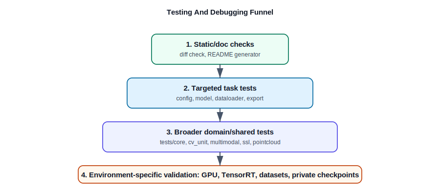

# Testing And Debugging

Use this guide to choose targeted tests and diagnose common TAO PyTorch
development failures.



## Test Directory Map

| Path | Coverage |
| :--- | :--- |
| `tests/core` | Shared launcher, config, logging, utility, and infrastructure behavior. |
| `tests/cv_unit_test/<task>` | Computer vision task tests. |
| `tests/multimodal_unit_test` | CLIP and RADIO unit tests. |
| `tests/multimodal_integration_test` | Multimodal integration tests. |
| `tests/ssl_unit_test` | MAE and NVDINOv2 tests. |
| `tests/sdg_unit_test` | StyleGAN-XL tests. |
| `tests/pointcloud_unit_tests` | PointPillars and point-cloud tests. |
| `tests/distributed` | Distributed-launch and multi-node behavior. |

## Recommended Test Selection

For docs-only changes:

```sh
python tools/update_readme_supported_commands.py --check
git diff --check -- README.md docs/*.md docs/assets/*.svg tools/update_readme_supported_commands.py
```

For one task package:

```sh
pytest tests/cv_unit_test/<task>
```

For a narrow behavior:

```sh
pytest tests/cv_unit_test/<task>/test_config.py
pytest tests/cv_unit_test/<task>/test_export.py
```

For shared config or launcher changes:

```sh
pytest tests/core
pytest -m "config or schema_validation"
python tools/update_readme_supported_commands.py --check
```

For changes touching many CV tasks:

```sh
pytest -m "cv_unit and not tensorrt"
```

## GPU And TensorRT Sensitivity

Some tests need GPUs, TensorRT, ONNX Runtime, real datasets, or private
checkpoints. Do not treat a local CPU-only skip as full validation.

When a check cannot run locally, report:

* the command attempted,
* the missing requirement,
* the narrower validation that did run,
* the residual risk.

## Common Failures

| Symptom | Likely cause | What to check |
| :--- | :--- | :--- |
| `git status` fails on LFS clean filter | `.git/lfs/tmp` is not writable or LFS is misconfigured. | Use `git -c filter.lfs.process= -c filter.lfs.required=false status --short` for inspection; fix LFS before committing binary changes. |
| `tao_pt` is not found | Environment was not sourced. | `source scripts/envsetup.sh` |
| `nvidia_tao_core` import fails | `tao-core` submodule or `PYTHONPATH` is missing. | `git submodule update --init --recursive`; source `envsetup.sh`. |
| Docker pull fails | NGC auth or image access is missing. | `docker login nvcr.io`; inspect `docker/manifest.json`. |
| No GPUs in container | NVIDIA runtime/toolkit or `--gpus` is wrong. | `nvidia-smi` on host and in container; check `nvidia-container-toolkit`. |
| Hydra schema validation fails | YAML field does not match dataclass schema. | Compare `experiment_specs/*.yaml` with `nvidia_tao_pytorch/config/<task>`. |
| Checkpoint load fails | Wrong checkpoint type or missing passphrase/path. | Search task code for `checkpoint`, `.tlt`, `.pth`, `load_from_checkpoint`, and `TLTPyTorchCookbook`. |
| Outputs are root-owned | Container ran as root. | Use `tao_pt --run_as_user ...`. |
| Shared memory errors | Docker shm is too small. | Increase `--shm_size`, for example `--shm_size 30G`. |

## Debugging Patterns

Trace command launch:

```sh
rg -n "<command>=" setup.py
sed -n '1,260p' nvidia_tao_pytorch/core/entrypoint.py
```

Trace config:

```sh
find nvidia_tao_pytorch/config/<task> -maxdepth 2 -type f | sort
find nvidia_tao_pytorch/<domain>/<task>/experiment_specs -maxdepth 1 -type f | sort
```

Trace model build:

```sh
rg -n "build_model|build_nn|load_from_checkpoint|torch.load" nvidia_tao_pytorch/<domain>/<task>
```

Trace export:

```sh
rg -n "onnx|export|dynamic_axes|opset|TensorRT|trt" nvidia_tao_pytorch/<domain>/<task> nvidia_tao_pytorch/core
```

Trace dataloading:

```sh
rg -n "DataModule|Dataset|DataLoader|setup\\(|train_dataloader|predict_dataloader" nvidia_tao_pytorch/<domain>/<task>
```
